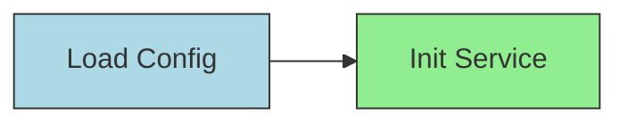
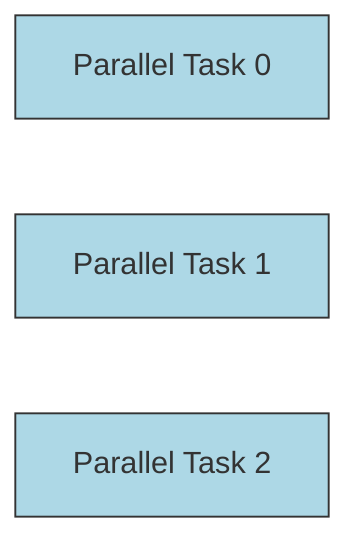
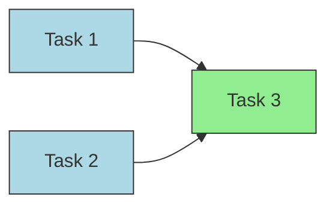
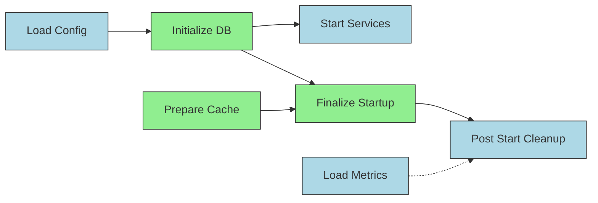
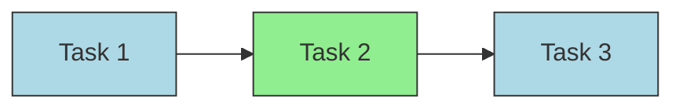
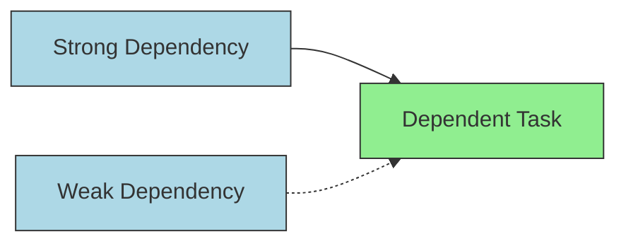
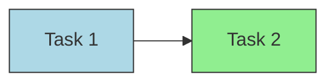

# KTaskFlow

基于 Kotlin 协程实现的通用任务编排框架，支持有向无环图（DAG）依赖调度，适用于复杂业务流程调度。

---

## 主要特性

- 支持**强依赖**和**弱依赖**，弱依赖可配置超时后自动放行
- 任务类型区分 I/O 密集型和 CPU 密集型，自动调度到不同线程池
- 支持任务取消及取消传播，防止不必要任务执行
- 内置任务超时控制和失败重试机制，支持回滚操作
- 支持异步通知，通过 `CompletableDeferred` 优雅等待任务结果
- 任务优先级调度，基于优先级队列动态调度
- 使用 Kotlin 协程 Channel 实现事件驱动任务调度，避免传统轮询带来的 CPU 空转

---

## 快速开始

```kotlin
fun main() = runBlocking {
    val dag = DAG().apply {
        val taskA = task("A", "Load Config", 1, TaskType.IO, SmartGenericTaskAction(Unit::class.java) {
            println("Task A running")
            delay(300)
            "config done"
        })
        val taskB = task("B", "Initialize DB", 1, TaskType.CPU, SmartGenericTaskAction(String::class.java) {
            println("Task B received input: $it")
            delay(500)
            "db ready"
        })
        taskB.dependsOn(taskA)
    }

    val scheduler = TaskScheduler(dag)
    scheduler.startAsync()

    val result = dag.getTaskResultAsync("B")
    println("Task B result: ${result.value}")
}
```

## 使用说明
* 创建 DAG 并定义任务，支持自定义 TaskAction，使用泛型封装输入输出类型
* 设置任务之间的依赖关系，支持强依赖 .dependsOn() 和弱依赖 .weakDependsOn()
* 使用 TaskScheduler 启动调度，异步执行任务
* 通过 DAG.getTaskResultAsync(taskId) 等待任务完成并获取结果
* 可调用 TaskScheduler.cancelTask(taskId) 取消任务及其后续依赖任务


## 常用示例

### 单任务

```kotlin
suspend fun testSingleTask() {

    val dag = DAG().apply {
        val task = task("1", "Single Task", 1, TaskType.IO,
            SmartGenericTaskAction(Unit::class.java) {
                println("Single task running")
                delay(300)
                "done"
            }
        )
    }

    val scheduler = TaskScheduler(dag)
    scheduler.startAsync()

    val result = dag.getTaskResultAsync("1")
    println(result.value)
}

fun main() = runBlocking {
    testSingleTask()
}
```

### 串行任务



```kotlin
suspend fun testSerialTasks() {
    val dag = DAG().apply {
        val t1 = task("1", "Load Config", 1, TaskType.IO,
            SmartGenericTaskAction(Unit::class.java) {
                println("Task 1 running")
                delay(500)
                "config"
            }
        )

        val t2 = task("2", "Init Service", 1, TaskType.CPU,
            SmartGenericTaskAction(String::class.java) {
                println("Task 2 received input: $it")
                delay(500)
                "service ready"
            }
        )

        t2.dependsOn(t1)
    }

    val scheduler = TaskScheduler(dag)
    scheduler.startAsync()

    val result = dag.getTaskResultAsync("2")
    println(result.value)
}

fun main() = runBlocking {
    testSerialTasks()
}
```

### 并行任务



```kotlin
suspend fun testParallelTasks() {
    val dag = DAG().apply {
        repeat(3) { i ->
            task("$i", "Parallel Task $i", 1, TaskType.IO,
                SmartGenericTaskAction(Unit::class.java) {
                    println("Parallel task $i running")
                    delay(300)
                    "result $i"
                }
            )
        }
    }

    val scheduler = TaskScheduler(dag)
    scheduler.startAsync()

    val result = dag.getTaskResultAsync("2")
    println(result.value)
}

fun main() = runBlocking {
    testParallelTasks()
}
```

### 依赖多个任务的输出



```kotlin
suspend fun testMultiDependencyInput() {
    val dag = DAG().apply {
        val t1 = task("1", "Task 1", 1, TaskType.IO,
            SmartGenericTaskAction(Unit::class.java) {
                println("Task 1 running")
                delay(300)
                "output1"
            }
        )
        val t2 = task("2", "Task 2", 1, TaskType.IO,
            SmartGenericTaskAction(Unit::class.java) {
                println("Task 2 running")
                delay(300)
                "output2"
            }
        )
        val t3 = task("3", "Task 3", 1, TaskType.CPU,
            SmartGenericTaskAction(List::class.java, String::class.java) {
                println("Task 3 received inputs: $it")
                delay(300)
                it.joinToString(", ")
            }
        )

        t3.dependsOn(t1, t2)
    }

    val scheduler = TaskScheduler(dag)
    scheduler.startAsync()

    val result = dag.getTaskResultAsync("3")
    println(result.value)
}

fun main() = runBlocking {
    testMultiDependencyInput()
}
```

### 复杂的任务



```kotlin
suspend fun testComplexDAGExample() {
    val dag = DAG().apply {
        val taskA = task("A", "Load Config", 1, TaskType.IO, SmartGenericTaskAction(Unit::class.java) {
            println("Task A running")
            delay(300)
            "config done"
        })

        val taskB = task("B", "Initialize DB", 1, TaskType.CPU, SmartGenericTaskAction(String::class.java) {
            println("Task B received input: $it")
            delay(500)
            "db ready"
        })

        val taskC = task("C", "Start Services", 1, TaskType.IO, SmartGenericTaskAction(String::class.java) {
            println("Task C received input: $it")
            delay(400)
            "services started"
        })

        val taskD = task("D", "Prepare Cache", 1, TaskType.CPU, SmartGenericTaskAction(Unit::class.java) {
            println("Task D running")
            delay(350)
            "cache ready"
        })

        val taskE = task("E", "Load Metrics", 1, TaskType.IO, SmartGenericTaskAction(Unit::class.java) {
            println("Task E running (slow)")
            delay(1500)  // 慢任务，测试弱依赖超时
            "metrics loaded"
        })

        val taskF = task("F", "Finalize Startup", 1, TaskType.CPU, SmartGenericTaskAction(List::class.java, String::class.java) {
            println("Task F received inputs: $it")
            delay(300)
            "startup finalized"
        })

        val taskG = task("G", "Post Start Cleanup", 1, TaskType.IO, SmartGenericTaskAction(String::class.java) {
            println("Task G running after weak dep")
            delay(200)
            "cleanup done"
        })

        // 依赖关系
        taskB.dependsOn(taskA)  // A -> B
        taskC.dependsOn(taskB)  // B -> C
        taskF.dependsOn(taskB, taskD)  // F 依赖 B 和 D
        taskG.dependsOn(taskF)  // G 依赖 F

        // 并行无依赖 D, E
        // 弱依赖 E
        taskG.weakDependsOn(taskE)
        taskG.weakDependencyTimeout = 1000L  // 超过1秒弱依赖超时继续执行
    }

    val scheduler = TaskScheduler(dag)
    scheduler.startAsync()


    delay(5000) // 确保弱依赖超时触发
    scheduler.shutdown()

    println(generateDotFile(dag))
}

fun main() = runBlocking {
    testComplexDAGExample()
}
```

### 动态添加任务



```kotlin
suspend fun testDynamicAddTasks() {
    val dag = DAG().apply {
        val task1 = task("1", "Task 1", 1, TaskType.IO, SmartGenericTaskAction(Unit::class.java) {
            println("Task 1 running...")
            delay(500)
            "result1"
        })
        val task2 = task("2", "Task 2", 1, TaskType.CPU, SmartGenericTaskAction(String::class.java){
            println("Task 2 received: $it")
            delay(700)
            "result2"
        })
        task2.dependsOn(task1)
    }

    val scheduler = TaskScheduler(dag)
    scheduler.startAsync()

    // 等待 task2 运行中
    delay(600)

    println("动态添加 task3，依赖 task2")

    // 新增任务 task3，依赖 task2
    val task3 = Task(
        id = "3",
        taskName = "Task 3",
        priority = 1,
        type = TaskType.IO,
        taskAction = SmartGenericTaskAction(String::class.java) {
            println("Task 3 received: $it")
            delay(400)
            "result3"
        }
    )

    // 添加任务和依赖
    task3.dependsOn(dag.getTaskById("2")!!)
    dag.addTask(task3)

    // 通知调度器任务准备就绪
    scheduler.addAndSchedule(task3)

    val r3 = dag.getTaskResultAsync("3")
    println("Task 3 result: ${r3.value}")
}

fun main() = runBlocking {
    testDynamicAddTasks()
}
```

### 弱依赖超时



```kotlin
suspend fun testWeakDependencyTimeout() {
    val dag = DAG().apply {
        val t1 = task("1", "Strong Dependency", 1, TaskType.IO,
            SmartGenericTaskAction(Unit::class.java) {
                println("Strong dep running")
                delay(300)
                "strong done"
            }
        )
        val t2 = task("2", "Weak Dependency", 1, TaskType.IO,
            SmartGenericTaskAction(Unit::class.java) {
                println("Weak dep running (will delay long)")
                delay(3000) // 故意长延迟，触发弱依赖超时
                "weak done"
            }
        )
        val t3 = task("3", "Dependent Task", 1, TaskType.CPU,
            SmartGenericTaskAction(String::class.java) {
                println("Dependent task running after strong dep")
                delay(300)
                it
            }
        )

        t3.dependsOn(t1)         // 强依赖
        t3.weakDependsOn(t2)     // 弱依赖
        t3.weakDependencyTimeout = 1000    // 弱依赖最多等 1 秒
        t3.executionTimeout = 2000         // 任务执行最多 2 秒
    }

    val scheduler = TaskScheduler(dag)
    scheduler.startAsync()

    val result = dag.getTaskResultAsync("3")
    println("Task3 result = ${result.value}")
}

fun main() = runBlocking {
    testWeakDependencyTimeout()
}
```

### 取消任务



```kotlin
suspend fun testTaskCancelPropagation() {
    val dag = DAG().apply {
        val t1 = task("1", "Task 1", 1, TaskType.IO,
            SmartGenericTaskAction(Unit::class.java) {
                println("Task 1 running...")
                delay(1000)
                "done"
            }
        )
        val t2 = task("2", "Task 2", 1, TaskType.CPU,
            SmartGenericTaskAction(String::class.java) {
                println("Task 2 received: $it")
                delay(1000)
                "done"
            }
        )
        t2.dependsOn(t1)
    }

    val scheduler = TaskScheduler(dag)
    scheduler.startAsync()

    // 取消任务1，应该导致任务2无法运行
    delay(300)
    scheduler.cancelTask("1")
}

fun main() = runBlocking {
    testTaskCancelPropagation()
}
```

### 失败重试、回滚

```kotlin
suspend fun testFailureRetryAndRollback() {
    val dag = DAG().apply {
        val t1 = task("1", "Flaky Task", 1, TaskType.IO,
            SmartGenericTaskAction(Unit::class.java) {
                println("Attempting flaky task")
                delay(300)
                if (Math.random() < 0.7) throw RuntimeException("Random failure")
                "success"
            }
        )
        t1.retries = 3
        t1.retryDelay = 500
        t1.failureCallback = { println("Failure callback triggered") }
        t1.rollbackAction = { println("Rollback triggered") }
    }

    val scheduler = TaskScheduler(dag)
    scheduler.startAsync()

    val result = dag.getTaskResultAsync("1")
    println(result.value)
}

fun main() = runBlocking {
    testFailureRetryAndRollback()
}
```

