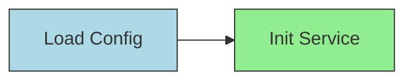
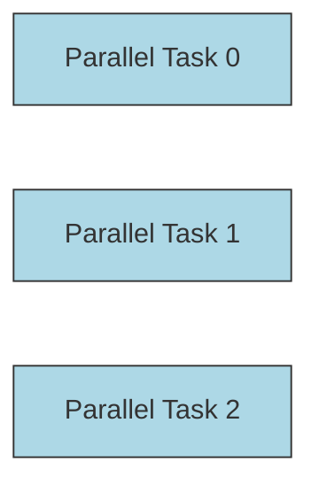
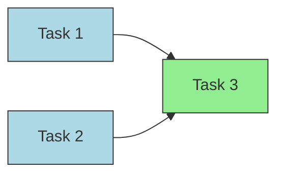

# KTaskFlow

基于 Kotlin 协程实现的通用任务编排框架，支持有向无环图（DAG）依赖调度，适用于复杂业务流程调度。

---

## 主要特性

- 支持**强依赖**和**弱依赖**，弱依赖可配置超时后自动放行
- 任务类型区分 I/O 密集型和 CPU 密集型，自动调度到不同线程池
- 支持任务取消及取消传播，防止不必要任务执行
- 内置任务超时控制和失败重试机制，支持回滚操作
- 支持异步通知，通过 `CompletableDeferred` 优雅等待任务结果
- 任务优先级调度，基于优先级队列动态调度
- 使用 Kotlin 协程 Channel 实现事件驱动任务调度，避免传统轮询带来的 CPU 空转

---

## 快速开始

```kotlin
fun main() = runBlocking {
    val dag = DAG().apply {
        val taskA = task("A", "Load Config", 1, TaskType.IO, SmartGenericTaskAction<Unit, String> {
            println("Task A running")
            delay(300)
            "config done"
        })
        val taskB = task("B", "Initialize DB", 1, TaskType.CPU, SmartGenericTaskAction<String, String> {
            println("Task B received input: $it")
            delay(500)
            "db ready"
        })
        taskB.dependsOn(taskA)
    }

    val scheduler = TaskScheduler(dag)
    scheduler.startAsync()

    val result = dag.getTaskResultAsync("B")
    println("Task B result: ${result.value}")
}
```

## 使用说明
* 创建 DAG 并定义任务，支持自定义 TaskAction，使用泛型封装输入输出类型
* 设置任务之间的依赖关系，支持强依赖 .dependsOn() 和弱依赖 .weakDependsOn()
* 使用 TaskScheduler 启动调度，异步执行任务
* 通过 DAG.getTaskResultAsync(taskId) 等待任务完成并获取结果
* 可调用 TaskScheduler.cancelTask(taskId) 取消任务及其后续依赖任务


## 常用示例

### 单任务

```kotlin
suspend fun testSingleTask() {

    val dag = DAG().apply {
        val task = task("1", "Single Task", 1, TaskType.IO,
            SmartGenericTaskAction<Unit, String> {
                println("Single task running")
                delay(300)
                "done"
            }
        )
    }

    val scheduler = TaskScheduler(dag)
    scheduler.startAsync()

    val result = dag.getTaskResultAsync("1")
    println(result.value)
}

fun main() = runBlocking {
    testSingleTask()
}
```

### 串行任务

```kotlin
suspend fun testSerialTasks() {
    val dag = DAG().apply {
        val t1 = task("1", "Load Config", 1, TaskType.IO,
            SmartGenericTaskAction<Unit, String> {
                println("Task 1 running")
                delay(500)
                "config"
            }
        )

        val t2 = task("2", "Init Service", 1, TaskType.CPU,
            SmartGenericTaskAction<String, String> {
                println("Task 2 received input: $it")
                delay(500)
                "service ready"
            }
        )

        t2.dependsOn(t1)
    }

    val scheduler = TaskScheduler(dag)
    scheduler.startAsync()

    val result = dag.getTaskResultAsync("2")
    println(result.value)
}

fun main() = runBlocking {
    testSerialTasks()
}
```



### 并行任务

```kotlin
suspend fun testParallelTasks() {
    val dag = DAG().apply {
        repeat(3) { i ->
            task("$i", "Parallel Task $i", 1, TaskType.IO,
                SmartGenericTaskAction<Unit, String> {
                    println("Parallel task $i running")
                    delay(300)
                    "result $i"
                }
            )
        }
    }

    val scheduler = TaskScheduler(dag)
    scheduler.startAsync()

    val result = dag.getTaskResultAsync("2")
    println(result.value)
}

fun main() = runBlocking {
    testParallelTasks()
}
```



### 依赖多个任务的输出

```kotlin
suspend fun testMultiDependencyInput() {
    val dag = DAG().apply {
        val t1 = task("1", "Task 1", 1, TaskType.IO,
            SmartGenericTaskAction<Unit, String> {
                println("Task 1 running")
                delay(300)
                "output1"
            }
        )
        val t2 = task("2", "Task 2", 1, TaskType.IO,
            SmartGenericTaskAction<Unit, String> {
                println("Task 2 running")
                delay(300)
                "output2"
            }
        )
        val t3 = task("3", "Task 3", 1, TaskType.CPU,
            SmartGenericTaskAction<List<String>, String> {
                println("Task 3 received inputs: $it")
                delay(300)
                it.joinToString(", ")
            }
        )

        t3.dependsOn(t1, t2)
    }

    val scheduler = TaskScheduler(dag)
    scheduler.startAsync()

    val result = dag.getTaskResultAsync("3")
    println(result.value)
}

fun main() = runBlocking {
    testMultiDependencyInput()
}
```



### 取消任务

### 失败重试、回滚

### 动态添加任务

### 复杂的任务

### 弱依赖超时